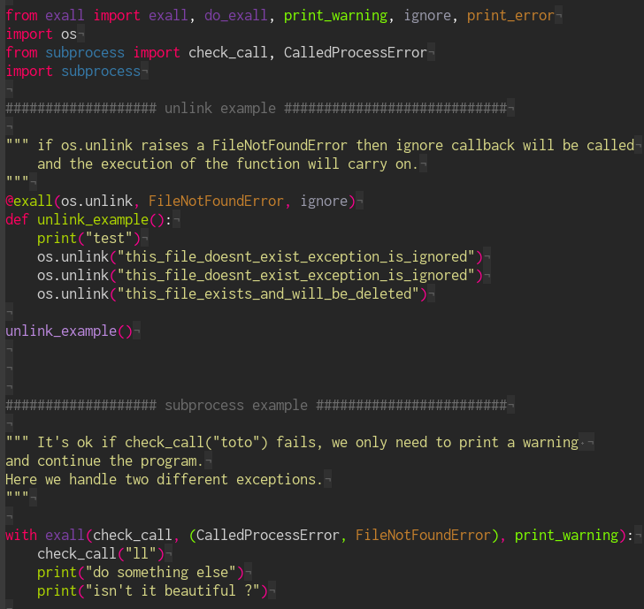
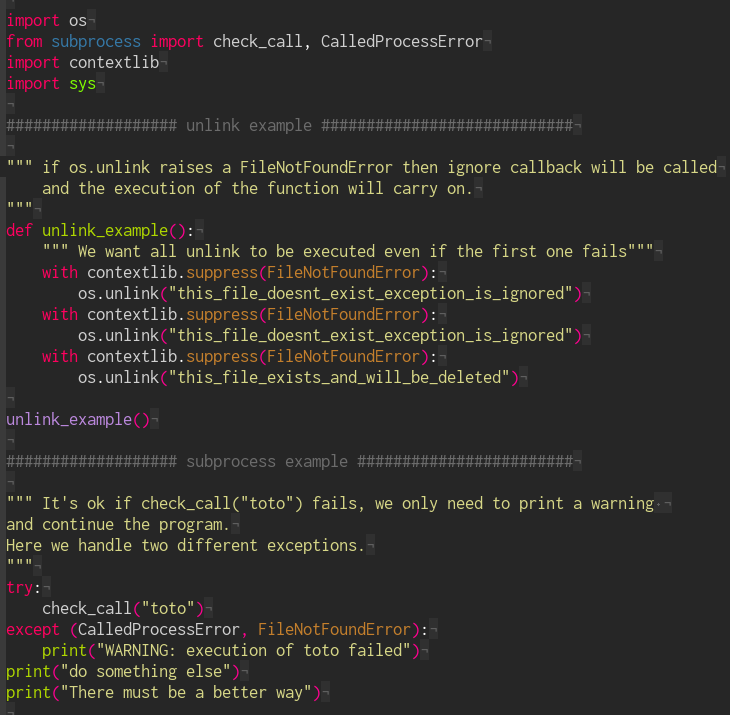
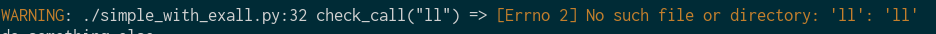
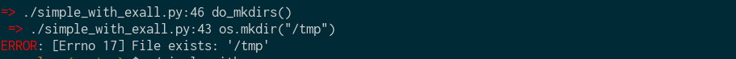

# Exall
Ease exception handling in python.

# Except them All
Exall is an exception manager based on decorator/context/callback.
Exall separates code logic from error handling, this reduces code duplication and ease development.


# Examples
Exall easily creates rules to associate Exceptions with callbacks using decorators.

| With Exall | Without Exall |
| --- |--- |
| |  |

# Install

```sh
pip install exall
```

# Callbacks
You are encouraged to create your own callbacks but here are the default callback output.

## Warning (print_warning)


## Error and exit (print_error)


----
By [@chaign\_c][] [#HexpressoTeam][hexpresso].


[hexpresso]:     https://hexpresso.github.io
[@chaign\_c]:    https://twitter.com/chaign_c
